# Overview

This section introduces the **core concepts and mental models** behind Mneme.
It is intended to help users understand *what Mneme records*, *what it replays*,
and *how its components fit together*.

For step-by-step instructions and command-line usage, see **[Getting Started](../usage/getting-started.md)**
and **[Usage](../usage/cli.md)**.

---

## What Mneme is

Mneme is a **GPU kernel record–replay and tuning system**.

It allows users to:
- record the execution of individual GPU kernels (CUDA / HIP),
- capture the device memory state those kernels operate on,
- replay kernels as independent executables, and
- systematically explore optimization and tuning choices.

Mneme operates **at the GPU kernel boundary** and is intentionally scoped
to kernel-level behavior.

---

## Architecture

The following diagram shows how the three phases connect and how data
flows from the original application to tuning results.

```mermaid
flowchart TB
    %% ── Styles ──
    classDef input fill:#e8f4fd,stroke:#4a90d9,color:#1a1a1a,font-weight:bold
    classDef process fill:#4a90d9,stroke:#2c5f8a,color:#fff,font-weight:bold
    classDef artifact fill:#f5a623,stroke:#c17d12,color:#fff,font-weight:bold
    classDef decision fill:#7b68ee,stroke:#5a4fcf,color:#fff,font-weight:bold
    classDef terminal fill:#5cb85c,stroke:#3d8b3d,color:#fff,font-weight:bold
    classDef phase fill:#f8f9fb,stroke:#8899aa,font-weight:bold

    %% ════════════════════════════════════════
    %% Phase 1: Instrumentation — Build Time
    %% ════════════════════════════════════════
    subgraph build["<b>① Instrumentation — Build Time</b>"]
        direction TB
        src["<b>Application Source Code</b>"]:::input
        compile["<b>Clang + Proteus LLVM Pass</b>"]:::process
        src --> compile
    end
    class build phase

    compile --> exe
    exe[/"<b>⬡ Recordable Executable</b>"/]:::artifact

    %% ════════════════════════════════════════
    %% Phase 2: Recording — Runtime
    %% ════════════════════════════════════════
    exe ==> intercept

    subgraph record["<b>② Recording — Runtime</b>"]
        direction TB
        intercept["<b>Intercept Device Allocations<br/>& Kernel Launches</b>"]:::process
        intercept --> gen["<b>Generate Recording Artifacts</b>"]:::process
    end
    class record phase

    gen --> rdb

    subgraph rdb["<b>⬡ Recording Database</b>"]
        rdb_contents["<b>• Kernel Metadata · .json<br/>• LLVM IR · .bc<br/>• Prologue Snapshot · .mneme<br/>• Epilogue Snapshot · .mneme</b>"]:::artifact
    end
    class rdb artifact

    %% ════════════════════════════════════════
    %% Phase 3: Replay & Tuning — Runtime
    %% ════════════════════════════════════════
    rdb ==> load

    subgraph replay["<b>③ Replay & Tuning — Runtime</b>"]
        direction TB
        load["<b>Load Memory State at<br/>Recorded Device Addresses</b>"]:::process
        select["<b>Select Kernel Configuration<br/>(threads, blocks, launch bounds, optimizations)</b>"]:::process
        execver["<b>Execute & Verify Kernel</b>"]:::process
        store["<b>Store Result in DB</b>"]:::process
        cont{"<b>Continue Tuning?</b>"}:::decision
        done(["<b>Done</b>"]):::terminal

        load --> select
        select --> execver
        execver --> store
        store --> cont
        cont -- "<b>Yes</b>" --> select
        cont -- "<b>No</b>" --> done
    end
    class replay phase
```

---

## Core idea: isolate the kernel

The central design principle of Mneme is **kernel isolation**. 
Large applications typically consist of many GPU kernels, each invoked
multiple times and operating on different data.
So, instead of replaying an entire application, Mneme:

1. Identifies a GPU kernel at compile time,
2. Records everything required to execute that kernel correctly,
3. Replays the kernel *without* the original application.

This enables fast experimentation, reproducibility, and optimization
without rebuilding or rerunning the full application, while also enabling
automated collection of realistic kernel inputs.

---

## Mneme phases 

Mneme workflows are split into three phases, a single compile time phase and two runtime phases (**record** and **replay**).

### 1) Instrumentation (build time)

Before you can record anything, you compile the application with Mneme/Proteus instrumentation enabled. This build-time step:

- identifies the GPU kernel entry points Mneme will observe,
- embeds/associates the required LLVM IR and metadata needed for replay, and
- produces a **recordable executable** (an application binary that can be run under `mneme record`).

### 2) Record (runtime)

During `mneme record`, Mneme runs the recordable executable and captures, per kernel:

- **kernel identity** (including stable/static identifiers),
- **kernel instance arguments** (the values passed as arguments to the 
    kernel invocation stored in the prologue/epilogue snapshots),
- **launch configuration** (grid/block dimensions, shared memory),
- **device heap memory allocation** (stored in the prologue/epilogue snapshots),
- **device global variables** (stored in the prologue/epilogue snapshots), and
- references to the **recorded LLVM IR** produced by the **build time instrumentation** used later for replay.

The result is a recording database (JSON) plus associated artifact files.

### 3) Replay (runtime)

During `mneme replay`, Mneme:

- restores the recorded **prologue** device memory state,
- recompiles the kernel from LLVM IR (optionally applying transformations), and
- executes the kernel in isolation under controlled conditions
  (e.g., modified launch dimensions, specialization, or alternative pipelines).

Replay is designed to reproduce the recorded behavior and produce a
memory state equivalent to the recorded epilogue.

These phases are intentionally decoupled: once recorded, a kernel can be
replayed, verified, and tuned repeatedly without requiring the original
application or its runtime environment.

See **[Execution Phases](mneme-phases.md)** for details.

---

## Static and dynamic kernel identity

Mneme distinguishes between the static kernels, kernels defined within the application source code
and dynamic instances of those kernels. 

- **Static kernel identity**  
  The kernel’s source-level identity, represented by a *hash* (referred in *Mneme* terminology as a *static hash*). 

- **Dynamic execution identity**  
  A specific runtime instance of a kernel, represented by a
  *dynamic hash*. The dynamic hash encodes the kernel runtime configuration parameters (block dimensions and grid dimensions).

This distinction allows Mneme to separate the static part of a kernel (the code) from the dynamic instances that use different thread/block dimensions.

See **[Static vs Dynamic Hash](static-dynamic.md)** for details.

---

## Artifacts as the contract

Recording produces a well-defined set of artifacts that form the
contract between record and replay:

- a recording database (metadata and structure),
- device memory snapshots used to gather representative inputs and also the cornerstone of validating runs,
- LLVM IR (transformation and specialization surface).

These artifacts are immutable and replay-safe.

See **[Artifacts](artifacts.md)** for the conceptual view and **[Usage → Recording artifacts](../usage/artifacts.md)**
for file-level details.

---

## LLVM IR as the transformation boundary

Mneme treats **LLVM IR as the optimization boundary**.

All replay, specialization, and tuning occurs at the LLVM IR level,
allowing:
- reuse of standard LLVM tooling,
- integration with custom compiler passes,
- backend retargeting via existing LLVM codegen.

See **[LLVM IR Boundary](llvm-boundary.md)** for details.

---

## Replay configuration

Replay execution is driven by an explicit **replay configuration** that
controls:
- launch dimensions,
- shared memory size,
- specialization options,
- compilation pipelines and optimization levels.

Replay configurations are first-class objects and form the basis of
tuning workflows.

See **[Replay Configuration](replay-configuration.md)** for details.

---

## Tuning model

Mneme’s tuning model builds on replay by:
- defining a search space over replay configurations,
- sampling configurations using user-defined strategies,
- validating correctness against recorded memory state,
- measuring and comparing performance.

Tuning is fully decoupled from recording and can be repeated or extended
without re-recording.

See **[Tuning Model](tune.md)** for details.

---

## What Mneme does *not* do

Mneme intentionally does **not**:
- record host-side control flow,
- capture CPU memory state,
- replay full applications,
- infer application-level semantics.

Mneme focuses on GPU kernel behavior and provides building blocks
for higher-level workflows.

---

## When to use Mneme

Mneme is well suited for:
- kernel-level performance tuning,
- compiler and codegen experimentation,
- regression analysis and performance archaeology,
- reproducible kernel benchmarks.
- compiler optimization debugging

If your workflow benefits from isolating GPU kernels from large
applications, Mneme is likely a good fit.

